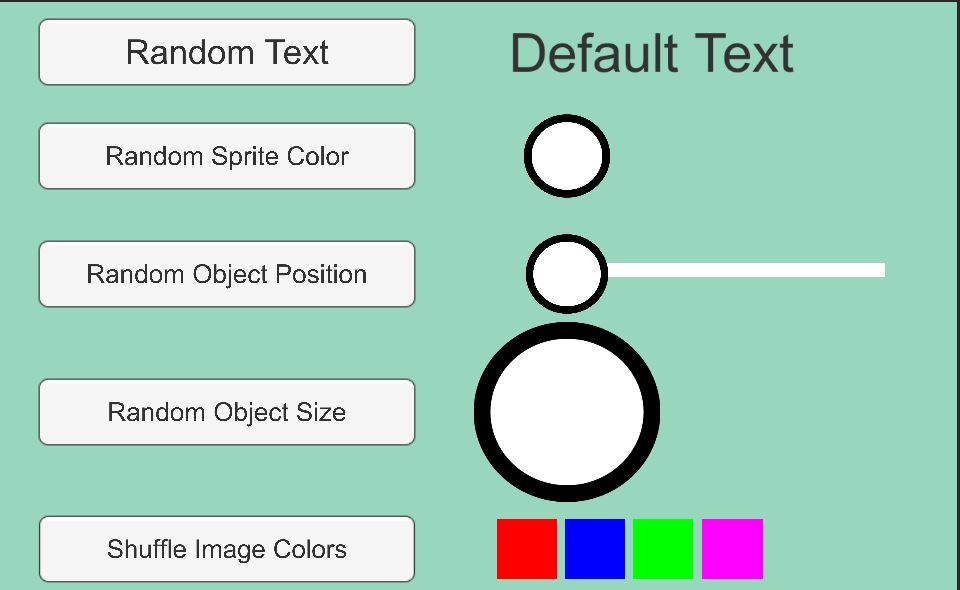

# smeerws-Randomness

### Project description: 
A 2D Unity project to showcase some different examples for using Randomness (System.Random and UnityEngine.Random).
The first example shows how to randomly change text.
The second example randomizes the color of sprites.
With the third and fourth example change the position and size based on a randomizer.
The last example shows how simply shuffle colors of UI Images when using Lists. 

Links: 
+ https://help.github.com/articles/fork-a-repo/
+ https://docs.unity3d.com/530/Documentation/ScriptReference/Random.html
+ https://docs.unity3d.com/530/Documentation/ScriptReference/Random-seed.html

### Development platform: 
Win 10, Unity Version: 2020.1.5f1, Visual Studio Version: VS Community 2019;

### Target platform: 
WebGL (reference resolution 960x600)

### Visuals: 

### Necessary setup/execution steps: 
Installation process, e.g. step by step instructions that I can run the project after cloning it
None

### Third party material: 
(if used Fonts, Sounds, Music, Graphics, Materials, Code etc.)
None

### Project state: 
100 percent

### Limitations: 
None

### Lessons Learned: 
+ System.Random unequal to UnityEngine.Random
+ Using randomness to manipulate the size and the position of objects
+ Using array and lists (method shuffle)

Copyright by smeerws

